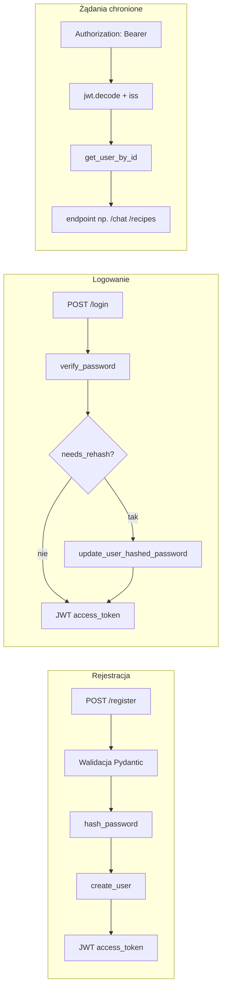

# Bezpieczeństwo autoryzacji: walidacja, hashowanie haseł (sól i pepper), JWT

## Cel i zakres

Raport opisuje wprowadzone usprawnienia bezpieczeństwa autoryzacji w projekcie Culinary App, zgodnie z wymaganiami:

- **Walidacja danych wejściowych** — odrzucanie lub normalizacja nieprawidłowych danych przed logiką biznesową.
- **Bezpieczne przechowywanie haseł** — bcrypt (wbudowana **sól** w każdym hashu) oraz opcjonalny **pepper** aplikacyjny (wspólny sekret serwera przed bcrypt).
- **Tokeny JWT** — uwierzytelnianie żądań do chronionych endpointów bez sesji po stronie serwera.

Działająca implementacja znajduje się w backendzie FastAPI w katalogu `Culinary-App/backend/`.

---

## Co zostało dodane (implementacja w kodzie)

| Obszar | Plik | Opis |
|--------|------|------|
| Hashowanie | `Culinary-App/backend/security.py` | `hash_password` / `verify_password` przy użyciu `passlib` (bcrypt). Gdy ustawiono `PASSWORD_PEPPER`, materiał wejściowy do bcrypt to stałej długości hex z `HMAC-SHA256(pepper, hasło_jawne)`; w przeciwnym razie — jak wcześniej `bcrypt(hasło_jawne)`. Weryfikacja najpierw próbuje wariant z pepperem (jeśli skonfigurowany), potem **legacy** `bcrypt(hasło_jawne)` dla starych rekordów. Zwracana jest para `(czy_poprawne, czy_wymaga_rehash)` — przy udanym logowaniu legacy przy aktywnym pepperze zapis aktualizuje hash w bazie. |
| Baza użytkowników | `Culinary-App/backend/database.py` | `create_user` wywołuje `hash_password` przy rejestracji; `update_user_hashed_password` służy do migracji hashy po logowaniu. |
| API i JWT | `Culinary-App/backend/main.py` | Modele Pydantic: m.in. `RegisterBody` (`EmailStr`, długość hasła, zgodność `password` / `confirm_password`, normalizacja emaila), `ChatRequest` z limitami długości. JWT (`python-jose`, HS256): `create_access_token` ustawia `exp`, `iat`, `iss`; `get_current_user` dekoduje token z nagłówka `Authorization: Bearer`, sprawdza `iss`; `OAuth2PasswordBearer(tokenUrl="/login")`. Przy starcie: walidacja `JWT_SECRET` (ostrzeżenie lub `RuntimeError` gdy `ENV=production` i sekret domyślny / zbyt krótki); log ostrzegawczy przy braku `PASSWORD_PEPPER`. Endpointy `/register`, `/login` zwracają token; chronione trasy używają `Depends(get_current_user)`. |

Szczegóły implementacyjne warto czytać bezpośrednio w powyższych plikach.

---

## Jak to działa (przepływ)

- **Rejestracja:** po poprawnej walidacji hasło jest hashowane, użytkownik zapisywany, klient otrzymuje JWT.
- **Logowanie:** weryfikacja hasła; jeśli hash był w formacie legacy a pepper jest włączony — aktualizacja zapisu hasha, następnie wydanie JWT.
- **Chronione API:** token jest dekodowany, sprawdzany issuer (`iss`), identyfikator użytkownika z `sub` łączy się z rekordem w bazie.

---

## Ręczna implementacja a usprawnienie pipeline

- **Kod aplikacji i konfiguracja** — zmiany wprowadzono **bezpośrednio w repozytorium** w projekcie **Culinary-App** (pliki Python w `backend/`, `requirements.txt`, dokumentacja README oraz `backend/.env.example`). To one determinują zachowanie w czasie działania serwera.

- **Pipeline-Agents** — zaktualizowano **dokumentację i specyfikację zadań** dla agentów (m.in. `Pipeline-Agents/docs/task_definition.md`, `architecture.md`, `technologies.md`). Dokumenty te opisują te same wymagania (walidacja, bcrypt + pepper, JWT, legacy + rehash), aby przyszłe przebiegi pipeline generowały kod zgodny z ustalonym modelem bezpieczeństwa. **Nie zastępują one** działającego backendu — same pliki MD w folderze `Pipeline-Agents/docs/` nie wykonują logiki auth.

**Podsumowanie:** bezpieczeństwo w uruchomionej aplikacji wynika z **implementacji w Culinary-App**. Pipeline został **usprawniony po stronie dokumentacji i wytycznych** dla agentów, a nie „wdrożył” autoryzację bez odpowiadającego kodu w backendzie.

---

## Zmienne środowiskowe

Zgodnie z `Culinary-App/backend/.env.example`:

| Zmienna | Rola |
|---------|------|
| `JWT_SECRET` | Sekret podpisu JWT (HS256); w produkcji powinien być długi, losowy (np. `openssl rand -hex 32`). |
| `PASSWORD_PEPPER` | Opcjonalny wspólny sekret serwera — przed bcrypt stosowany jest `HMAC-SHA256(pepper, password)` (hex). Po ustawieniu nowe rejestracje i uaktualnienia przy logowaniu używają tego schematu; stare zapisy `bcrypt(plain)` nadal działają i mogą być automatycznie przeliczane przy logowaniu. |
| `ENV` | Gdy ustawione na `production`, słaby lub domyślny `JWT_SECRET` powoduje **błąd startu** aplikacji zamiast samego ostrzeżenia w logu. |

Opcjonalnie: `RAPORTS_DIR` — ścieżka do raportów pipeline (nie jest wymagana do działania auth).

---

## Zależności Python (backend)

W `Culinary-App/backend/requirements.txt` m.in.:

- **passlib[bcrypt]**, **bcrypt** — hashowanie haseł.
- **python-jose[cryptography]** — wydawanie i weryfikacja JWT (HS256).
- **email-validator** — walidacja adresów email przy użyciu `EmailStr` w Pydantic.
- **python-multipart** — obsługa formularza OAuth2 (`OAuth2PasswordRequestForm`) na `POST /login`.

---

## Powiązane pliki dokumentacji pipeline

- `Pipeline-Agents/docs/task_definition.md` — szczegółowe wymagania bezpieczeństwa dla implementacji.
- `Pipeline-Agents/docs/architecture.md` — opis warstwy auth w architekturze.
- `Pipeline-Agents/docs/technologies.md` — uzasadnienie stosu JWT + bcrypt (+ opcjonalny pepper).
